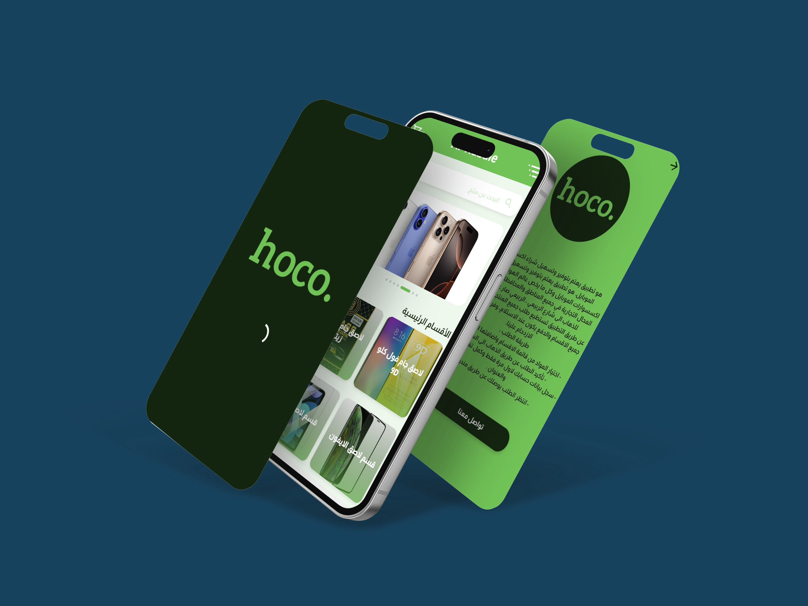

# alrubaie-ui

**Alrubaie E-commerce App built with Flutter.**  
منصة الكترونية لتجارة الاكسسوارات في **بغداد – شارع الربيعي**، تم تطويرها باستخدام إطار عمل **Flutter**.

## ✨ نظرة عامة
توفر المنصة تجربة تسوّق سهلة وسريعة للمستخدمين واصحاب المحال التجارية، حيث يمكنهم:
- تصفح المنتجات المتنوعة.
- شراء المنتجات مباشرة من التطبيق.
- الاستفادة من خدمة الشحن السريع إلى مواقعهم.

تلتزم المنصة بتوفير تجربة مستخدم مريحة وآمنة لجميع الأطراف.

## 🖼️ صوره توضيحية للتطبيق

## 🚀 التقنيات المستخدمة
- Dart ( Flutter )
- Firebase && Supabase storage
- sqlite
- GetX لإدارة الحالة (حسب ما تستخدمه)
- MVC+S

## 📍 الموقع الجغرافي
بغداد - شارع الربيعي

## تم تطويره بواسطة : Abdullah Omar

